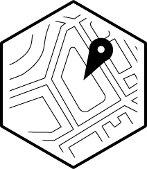
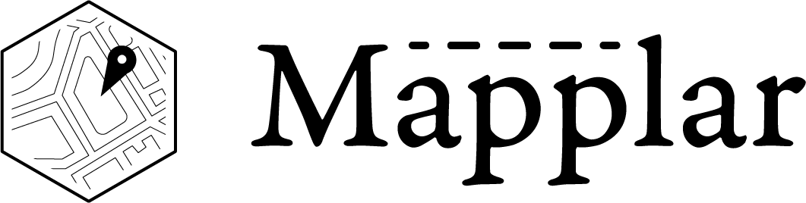

# Project Title - Mapplar

## Overview

Mapplar is able to help travellers to find and plan their intinerary for the
duration of their stay at any place/countries. It will have a map with markers
to show iconic places at set locations, users can hover over/ tap / click the markers to view
images uploaded by friends and allow the website to give the user the intinerary
plan.

### Problem

Travelling has been difficult when user don't have time to plan their
intinerary, even if they have the time, they will have to go through all
resources (websites/books) to plan what they want to do or places to visit
during their stay, this is more difficult especially for first time travellers.

### User Profile

Anyone who is looking to travel to another place/countries whether they are a
first time traveler to the new destination or have traveled to the destination
and wanting to visit iconic sites and have the days plan for them to avoid
any stress.

### Features

- users authentication system
- interactive map
- interactive itinerary
- display pictures of iconic sites in the cities

List the functionality that your app will include. These can be written as user stories or descriptions with related details. Do not describe _how_ these features are implemented, only _what_ needs to be implemented.

## Implementation

### Tech Stack

List technologies that will be used in your app, including any libraries to save
time or provide more functionality. Be sure to research any potential
limitations.

- React
- React Router
- Node - Express
- Knex
- MapBox
- Database - SQL
- react-icons

### APIs

List any external sources of data that will be used in your app.

MapBox - Map interaction with pictures
OpenAi - Generating Itinerary
Firebase - Upload image and return image url
EXIF - npm package to return EXIF Metadata

### Sitemap

List the pages of your app with brief descriptions. You can show this visually,
or write it out.

Not a user

Hero / Landing Page, Sign in / Up Page

User
Home / Social Page, Map Plannar Page , User Profile, Sign Out

### Mockups

Provide visuals of your app's screens. You can use tools like Figma or pictures
of hand-drawn sketches.

Logo -

Title with logo - 

Fonts Heading - Garamond Premier Pro

Fonts Body - Noto Sans

@import url('https://fonts.googleapis.com/css?family=Garamond%20Premier%20Pro:700|Noto%20Sans:400');

body {
font-family: 'Noto Sans';
font-weight: 400;
}

h1, h2, h3, h4, h5 {
font-family: 'Garamond Premier Pro';
font-weight: 700;
}

Color Palette -

light: (

- text: #020812,
- background: #f1f5fe,
- primary: #4c82f6,
- secondary: #bddaa4,
- accent: #f08c00,
  ),
  

### Data

Describe your data and the relationships between them. You can show this
visually using diagrams, or write it out.

Most of them are one to many relationships

### Endpoints

List endpoints that your server will implement, including HTTP methods,
parameters, and example responses.

/user/:id
/user/:id/itinerary/
/user/:id/itinerary/:id
/destination
/sites/:site_id

### Auth

Does your project include any login or user profile functionality? If so,
describe how authentication/authorization will be implemented.

Could require a login feature where for a non-user will only show Home/Sign-In
page. After the user has logged in there will be a social media page,
map-planning page and a sign-out page. A Mock Auth would be done first then nice
to have (diving deeper)

## Roadmap

Scope your project as a sprint. Break down the tasks that will need to be
completed and map out timeframes for implementation. Think about what you can
reasonably complete before the due date. The more detail you provide, the easier
it will be to build.

-

## Nice-to-haves

- abilities to change from light mode to dark mode
  dark:

- - text: #edf3fd
- - background: #01050e
- - primary: #093fb3
- - secondary: #3e5b25
- - accent: #ff9b0f

  

- fully functing auth page for user

- send intinerary to user's email

Your project will be marked based on what you committed to in the above document. Under nice-to-haves, you can list any additional features you may complete if you have extra time, or after finishing.
