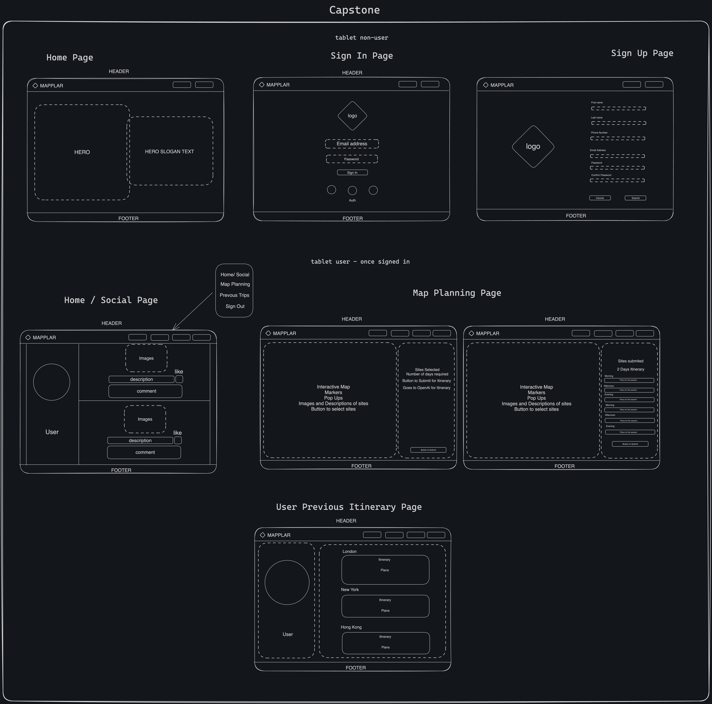

# Project Title - Mapplar

## Installation

To install the whole project, please `clone` / `fork` the project into your
directories, once you have downloaded the project then make sure you do
`npm install` to install all dependancy on both `client` and
`server`. Please make sure in the server side, you want to do `npm run
migrate` and then do `npm run seed`, this will migrate the latest
placeholders into the database to use, this is important especially for the site
pictures.

As for the `.env`, I have placed a `.env.sample` in the directories for both `client`
and `server` side. Use that as a guide to add that to your local machine for
testing purposes.

Aftwards do `npm start` on both `server` and `client` to start the
experience:

On load: there will be 3 navigation links: `Home Page`, `Sign Up` and `Login`.

`Home` Page - Hero section with a button that leads you to the sign up page.

`Sign Up` Page - Fill in your User name and other details. (Username is used for
Login).

`Login` Page - Requires Username and Password to login

On Logged In - there will be 3 navigation links: `Social`, `Planner` and
`Profile`.

`Social` Page - it will be currently be empty because you have not uploaded any
pictures, you can then click the select picture to upload a pciture with a
description. Make sure the images that you upload have geolocation at the
specific sites from planner.

`Planner` page - The main part of the capstone, using the map to navigate to a
choice of 3 cities: London, New York and Hong Kong. From there you can select
any sites you want to visit and select them. After selecting all your chosen
sites, either click the selected sites (in mobile) or it will show on the right
side (tablet/ desktop), you can then select the amount of days for your
itinerary (1-7 days). Upon confirming the sites and amount of days, you can
click generate itinerary. The loading animations will show and preparing your
perfect itinerary.

`Profile` page - An addition to the capstone is a way for you to search for
friends to follow, on the top there will be a search bar, from your seed data,
there will be random_user_1 - random_user_20. These are place holders with
different profiles. The main feature of the page is that you can see your recent
itinerary, so head back to your profile and click onto the sites you generated
and it will display in full detail the latest itinerary.

`Sign Out` - Clicking this will take you back out and taking the JWT token away so
you won't be able to access the rest of the sites except the Home, Sign-up and
Login.

If you want to see it working fully in action, I will deploy this therefore
there will be a clickable link eventually.

## Overview

Mapplar is able to help travellers to find and plan their intinerary for the
duration of their stay at any place/countries. It will have a map with markers
to show iconic places at set locations, users can hover over/ tap / click the markers to view
images uploaded by friends and allow the website to give the user the intinerary
plan.

### Problem

Travelling has been difficult when user don't have time to plan their
intinerary, even if they have the time, they will have to go through all
resources (websites/books) to plan what they want to do or places to visit
during their stay, this is more difficult especially for first time travellers.

### User Profile

Anyone who is looking to travel to another place/countries whether they are a
first time traveler to the new destination or have traveled to the destination
and wanting to visit iconic sites and have the days plan for them to avoid
any stress.

### Features

- users authentication system
- interactive map
- interactive itinerary
- display pictures of iconic sites in the city

## Implementation

### Tech Stack

- React
- MySQL
- Express
- Firebase
- Client libraries:
  - react
  - react-router
  - axios
  - mapbox
  - react-icons
  - exifr
  - sass
  - uuid
  - image-resize-compress
  - Material UI (MUI)
- Server libraries:
  - knex
  - express
  - axios
  - cors
  - dotenv
  - jsonwebtoken
  - bcrypt for password hashing (for auth)

### APIs

MapBox - Map interaction with pictures

OpenAi - Generating Itinerary

Firebase - Upload images and saved in databased based on Geolocation data

image-resize-compress - resize image filesize by reducing quality

EXIF - npm package to return EXIF Metadata

### Sitemap

Non-User

Hero / Landing Page, Sign in / Up Page

User
Home / Social Page, Map Plannar Page , User Profile / User itinerary Page, Sign Out

### Mockups

Logo -

Title with logo - 

### Fonts Heading - Garamond Premier Pro

### Fonts Body - Noto Sans

@import url('https://fonts.googleapis.com/css?family=Garamond%20Premier%20Pro:700|Noto%20Sans:400');

body {
font-family: 'Noto Sans';
font-weight: 400;
}

h1, h2, h3, h4, h5 {
font-family: 'Garamond Premier Pro';
font-weight: 700;
}

### Color Palette

#### light: (

- text: #020812,
- background: #f1f5fe,
- primary: #4c82f6,
- secondary: #bddaa4,
- accent: #f08c00,
  ),

### Data

Describe your data and the relationships between them. You can show this
visually using diagrams, or write it out.

Most of them are one to many relationships

#### New feature currently WIP have friends list and clicking onto icon in social page will lead you to their profile.

### Endpoints

- /signup
- /login
- /destination
- /destination/:id
- /site/:id
- /itinerary
- /post
- /post/image
- /profile
- /profile/destination/:city
- /profile/:userid
- /profile/:userid/destination/:city
- /search/:username
- /follow
- /follow/:userid

### Auth

Fully functioning JWT token for Login, all user-based activities/ events will
require authorisation in the back-end to get the end points. The JWT will be
saved in the session storage, upon signing out, the JWT will be removed
therefore bringing user back to non-user status.

## Roadmap

### Jira board

https://mapplar.atlassian.net/jira/software/projects/MAPPLAR/boards/1

- create database

  - migration
  - seed

- create server side

  - create all the end points for get destinations and sites
  - create post users for authentication (Login / Sign up page)
  - craete end point to send request body to OpenAi and receive response

- create client side

  - using mapbox and markers to map out all sites available for selection
  - create a post request to send selected sites to server
  - create a page for getting all previous itineraries for user

- bug fixes

- DEMO DAY

## Nice-to-haves

- abilities to change from light mode to dark mode
  dark:

  - text: #edf3fd
  - background: #01050e
  - primary: #093fb3
  - secondary: #3e5b25
  - accent: #ff9b0f

- fully functing auth page for user including google/ facebook and apple
  authenitcation

- ability to create different users like normal users, premium users and admins.

- send intinerary to user's email by generating PDF, either sending or
  downloading pdf.

- forget password functionality

- ability to add a paid feature for premium users for more indepth itiniery

- ability to edit or add new sites into the web app as an admin
